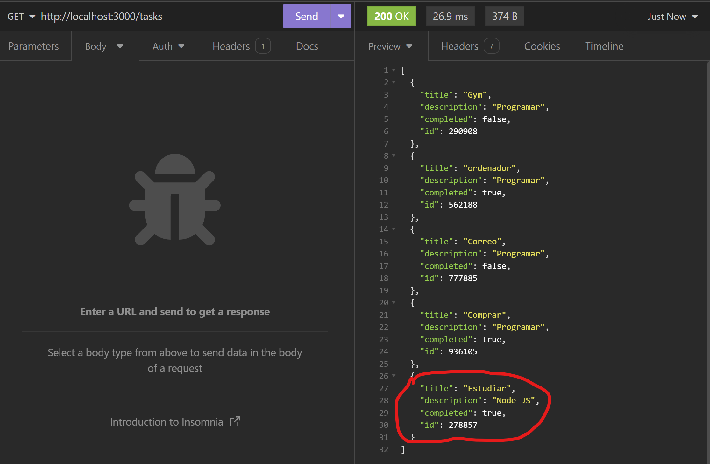

# Project Title
Rest Api JGM

### Prerequisites

- Node.js and npm


### Installing

1. Initialize npm:
```bash
npm init -y
```
2. Install TypeScript:
```bash
npm install typescript -D
```

3. Add the next line to package.json 
```bash
"scripts": {
    "tsc": "tsc"
```

4. Initialize TypeScript:
```bash
npm run tsc -- --init
```

5. Install Express:
```bash
npm install express -E
npm install --save-dev @types/express
```

6. Install Nodemon and ts-node for development:
```bash
npm install --save-dev nodemon ts-node
```

### Run App
```bash
npm start
```

## CRUD Request

### Put 
We add a task.


### Check new task on list
We get the list and check our new task is added.


### Complete 
We complete a task.


### Check completed task on list
We get the list and check our task is completed.



### Delete 
We delete a task.


### Check deleted task on list
We get the list and check our task is deleted.

